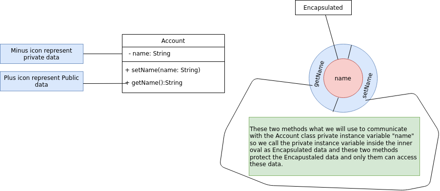
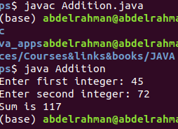
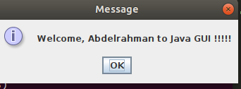
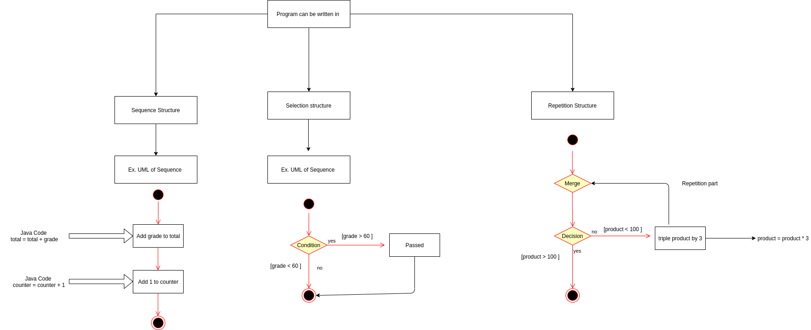

# Java-How-To-Program

## Early Objects

## TENTH EDITION

### Paul Deitel & Harvey Deitel

**This will be a long term repo for Java from the mentioned book above**

It will be a materials in English with some Arabic videos Inshallah that explain the material and solving some problems and exercises from the book after each chapter.

I will divide the book to some parts and each part will be  in list of videos and first part will be the first 7 chapters from the book, then we will spend some times to solve some problems from online judges like **codeforces** and **UVA**.

Also all of code documented and provided with hints and comments either the problem will be solved inshallah or the code in the book.

I will mentioned the most helpful section in the book as I can, but it will be great to study from the book itself and look for these material to help you save your study more, and return to it to make a revision.

**I have reached to the end of chapter 3, 7-3-2021**

This will be updated to the end of chapter 7, then I will move to explain each chapter in one video, provide you with the pdf summary of each chapter + all apps in this chapter with documented comments.

## Chapter 1

After the introudction about the java, Hardware and Software beside of Moores Law, Data Hierarchy which how data are from the 0,1 that computer can only accept to the Massive data todays **"Big Data"**.

- intro
- Methods and classes
- Instantiation
- Reuse
- Messages and Methods calls
- Attributes & Instance Variables
- Encalpsulation & Information Hiding
- Inheritance
- Interfaces
- Object Oriendt Analysis & Design with UML

## Chapter 2

 Introduction to Java Application Input, Output and Operators.

 After what mentioned in chapter 1 the author moved to next stage of creating a simple app to explain each line from the app, from the input to some operation and finally displying the result on the screen.

- Write Java app
- Input & Output statements
- Import Declaration
- Scanner Object
- Primitive data types
- Basic Memory Concept
- Arithmetic Operator
- Precedence of different operations ( Who should apply first).
- Decision Making
- Relational & Equality operator

## Chapter 3

We looked previously about how to take object from predefined class that java has and from this object we use the methods associated with this object, but what we doing here is to create our own class and use some objects from this class, then we can use the methods we will create inside.

- Declaration of classes and method
- Instance variables
- setName Methods of class Account
- Default Values of data types
- Floating-point
- Local and instance vraibles
- Calling Object and methods of class
- constructors
- UML Graphs
- Simple GUI

## Chapter 4

Before written a program to solve a problem, you should have a through understanding of the problem and carefully planned approach to solving it.

- Algorithms
- pseudocode
- Control Structure
	- Sequence Structure
	- Selection structure
	- Repetition Structure
- UML Activity Diagram
- Condition Operation

